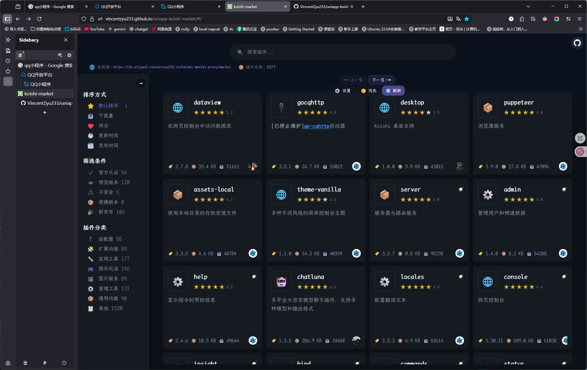
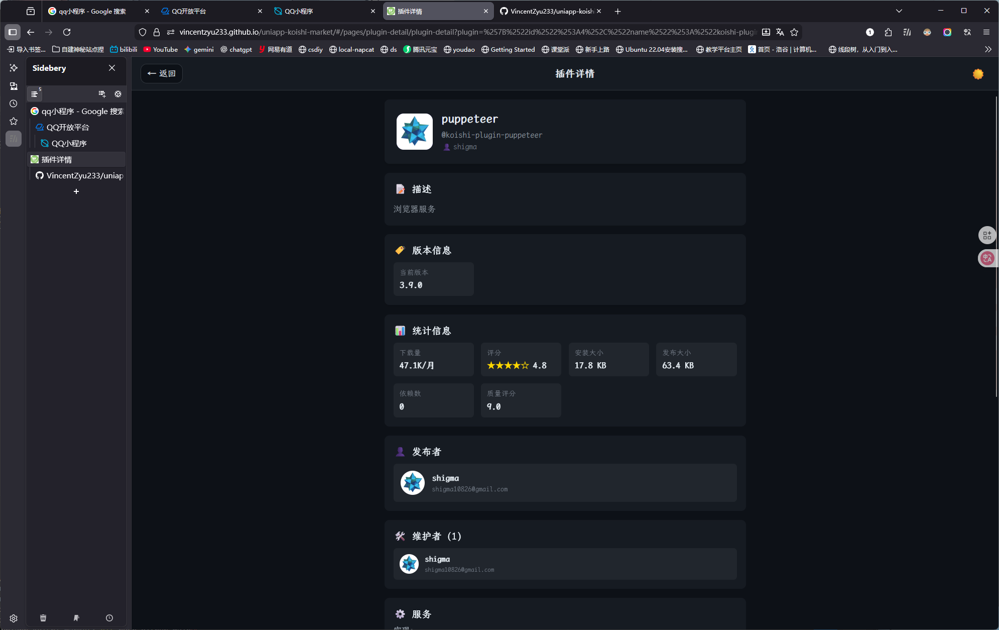
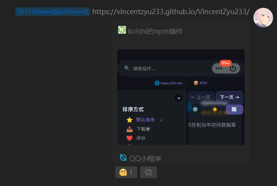

# uniapp-koishi-market

> 基于 UniApp 开发的 Koishi 插件市场浏览器，支持 GitHub Pages 和 QQ 小程序。

## 📸 预览

| 平台 | 截图 |
| :---: | :---: |
| Web 端 |  |
| 插件详情 |  |
| QQ 小程序 |  |

## 🔗 在线访问

- **GitHub Pages**：<https://vincentzyuapps.github.io/uniapp-koishi-market/#/>
- **QQ 小程序**：搜索 **koishi的npm插件**，或访问 <https://m.q.qq.com/a/s/780e4930897b10f165367ddcd6b46c16>

## 🛠️ 技术栈

| 层级 | 技术 | 说明 |
| --- | --- | --- |
| 前端框架 | [uni-app](https://github.com/dcloudio/uni-app) + [Vue](https://github.com/vuejs/vue) | 跨平台 UI 构建 |
| 后端数据 | [StoreLuna](https://github.com/koishi-shangxue-plugins/koishi-shangxue-apps/tree/main/plugins/storeluna) | Koishi 插件市场数据源 |
| API 服务 | [FastAPI](https://github.com/fastapi/fastapi) | CORS 中间件，提供接口服务 |
| 内网穿透 | [frp](https://github.com/fatedier/frp) | 转发后端服务 |
| 反向代理 | [Nginx](https://github.com/nginx/nginx) | 反代 & 静态资源托管 |

## 🚀 GitHub Action 部署

> **注意**：只有 commit message 中包含 `pub page` 时，才会触发 GitHub Pages 部署流程。  
> 手动 `workflow_dispatch` 触发不受此限制。

```shell
git add .
git add -f unpackage/dist/build/web/
git status --short
git status unpackage/dist/build/web/
git ls-files unpackage/dist/build/web/
git commit -m "pub page: 更新页面"   # commit message 需要包含 pub page 才会部署
git push github main
git push origin main
```