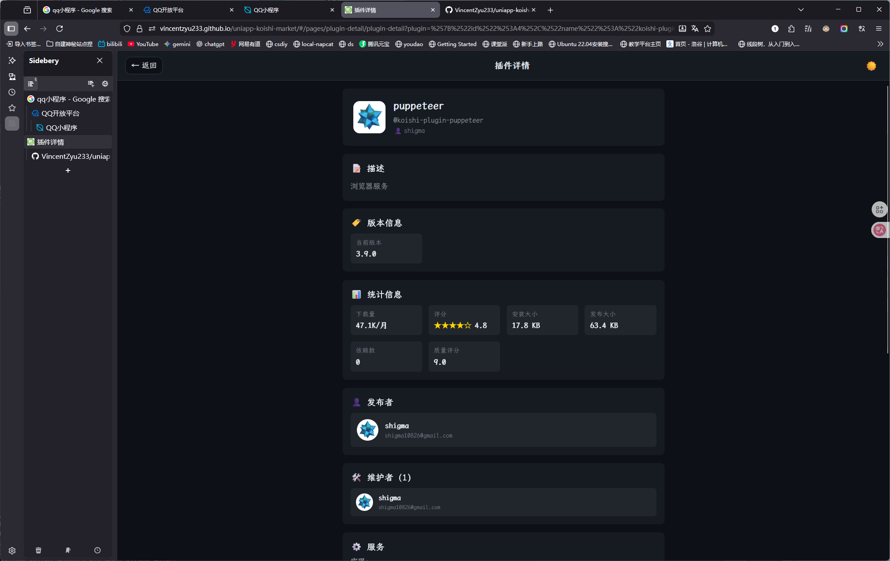

# uniapp-koishi-market

📦 基于 uni-app + Vue 3 的 Koishi 插件市场网页，支持多镜像源切换、插件搜索/筛选/排序，已部署为 GitHub Pages 网页端 & QQ 小程序。 

[](https://github.com/VincentZyuApps/uniapp-koishi-market)
<s>[](https://gitee.com/vincent-zyu/uniapp-koishi-market) (🔒已被Gitee强行Private，何意味)</s>
[](https://gitlab.com/VincentZyu233/uniapp-koishi-market)
[](https://codeberg.org/VincentZyu/uniapp-koishi-market)

> 🙃 Gitee的repo被平台莫名其妙设为私有。开放？自由？不存在的

## 🔗 在线访问

| 平台 | 入口 |
| :--- | :--- |
| **GitHub Pages** [](https://vincentzyuapps.github.io/uniapp-koishi-market/#/) | <https://vincentzyuapps.github.io/uniapp-koishi-market/#/> |
| **Cloudflare Pages** [](https://uniapp-koishi-market.pages.dev) | <https://uniapp-koishi-market.pages.dev> |
| **QQ 小程序** [](https://m.q.qq.com/a/s/780e4930897b10f165367ddcd6b46c16) | 搜索 **koishi的npm插件**，或者浏览器打开：<br><https://m.q.qq.com/a/s/780e4930897b10f165367ddcd6b46c16> |

## 📸 预览

| 平台 | 截图 |
| :---: | :---: |
| Web 端 |  |
| 插件详情 |  |
| QQ 小程序 |  |

## 🛠️ 技术栈

| 层级 | 技术 | 说明 |
| --- | --- | --- |
| 前端框架 | [uni-app](https://github.com/dcloudio/uni-app) + [Vue](https://github.com/vuejs/vue) | 跨平台 UI 构建 |
| 后端数据 | [StoreLuna](https://github.com/koishi-shangxue-plugins/koishi-shangxue-apps/tree/main/plugins/storeluna) | Koishi 插件市场数据源 |
| API 服务 | [FastAPI](https://github.com/fastapi/fastapi) | CORS 中间件，提供接口服务 |
| 内网穿透 | [frp](https://github.com/fatedier/frp) | 转发后端服务 |
| 反向代理 | [Nginx](https://github.com/nginx/nginx) | 反代 & 静态资源托管 |

## 🚀 GitHub Action 部署

> **注意**：只有 commit message 中包含 `pub page` 时，才会触发 GitHub Pages 部署流程。  
> 手动 `workflow_dispatch` 触发不受此限制。

### 📟 Git 命令行操作
```shell
# HBuilderX gui界面左上角： 发行 -> 发行到WebH5
python py-util/generate_cf_redirects.py
git add -A
git add -f unpackage/dist/build/web/
git status --short
git status unpackage/dist/build/web/
git ls-files unpackage/dist/build/web/
git commit -m "pub page: 更新页面"   # 如果想要更新ghpage和cfpage的话
git push github main
git push gitee main
git push gitlab main
git push codeberg main
```